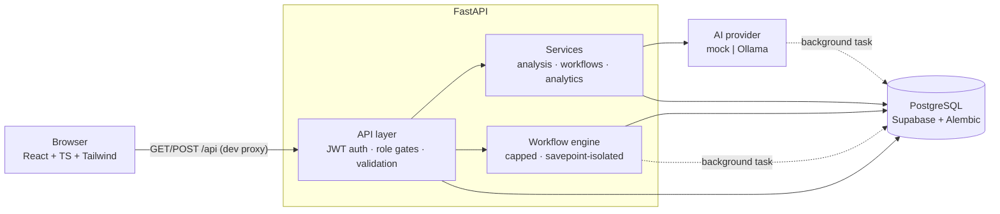

# AI Business Automation Platform

A portfolio-focused business automation platform: customers submit support
inquiries, AI analyzes and prioritizes them, and administrators manage
everything through a dashboard with capped, configurable automation workflows.

**Stack:** React + TypeScript + Tailwind (Vite) · Python + FastAPI ·
PostgreSQL (Supabase) · AI provider behind a backend-only abstraction
(deterministic `mock` by default, local **Ollama** optional).

## Features

**Customer portal** (`/portal`)
- Signup/login (JWT, HTTP-only flow handled by the client), role-aware redirects
- Submit tickets, track their own tickets, read status/priority and reply
- AI analysis runs automatically after submission — the customer sees a
  suggested reply drafted for a human to confirm

**AI analysis pipeline**
- One contract, swappable engines: `mock` (keyword rules, offline, deterministic)
  and `ollama` (local open-source model via `POST /api/chat`, JSON output)
- Classifies category, priority, sentiment; drafts summary + suggested response;
  writes category/priority back to the ticket
- Failures can never break ticket creation: any provider/validation error is
  persisted as a `failed` analysis with a sanitized message

**Admin console** (`/admin`, admin role required)
- Overview: status/priority/category aggregates, recent activity
- Cross-customer ticket management: filters, status changes (any valid status),
  AI reply review with human confirmation (`is_human_confirmed`), tags
- Customers list; workflows CRUD; analytics (7/30/90-day windows, UTC-day
  buckets, zero-filled)

**Workflow engine** (capped by design — `PLAN.md` §5)
- Single trigger `ticket.created` → AND-only conditions (≤ 5) → up to 5
  actions from 4 types: `set_priority`, `add_tag`,
  `generate_suggested_response`, `record_notification`
- Guarantee: exactly one `workflow_runs` row per evaluation (`success`,
  `skipped`, or `failed`); failing actions are rolled back via savepoint, so a
  half-applied automation leaves no trace beyond its failed run
- The engine never raises into a request

**Demo data**
- `python -m app.cli.seed_demo` seeds a fictional business (admin + customers +
  12 tickets covering every category/priority/sentiment/status across ~9 days,
  analyses through the real pipeline, workflows demonstrating all three run
  states). Everything is tagged `is_demo` and removed with one command —
  real data is never touched.

## Screenshots

<!-- TODO: capture from the running app and drop in below -->
| Admin overview | Workflows | Analytics |
| --- | --- | --- |
| _placeholder_ | _placeholder_ | _placeholder_ |

| Customer portal | Ticket detail + AI review |
| --- | --- |
| _placeholder_ | _placeholder_ |

## Architecture



Ticket creation returns immediately; AI analysis and workflow evaluation run
as background steps, each opening its own database session.

## Tech stack

| Layer | Choice |
| --- | --- |
| Frontend | Vite + React 19 + TypeScript + Tailwind CSS + React Router |
| Backend | FastAPI + Pydantic settings + SQLAlchemy 2 + Alembic |
| Database | PostgreSQL (Supabase), session pooler on port 5432 |
| Auth | JWT (Bearer), bcrypt via passlib, admin role gated server-side |
| AI | Provider interface: `mock` (default) · `ollama` (local, optional) |
| Tests | pytest (72 tests) · ESLint + `tsc` build gate |

## Prerequisites

- Python 3.12+
- Node 20+ (tested on 24)
- A Supabase project (any PostgreSQL connection works)
- Optional for real AI analysis: [Ollama](https://ollama.com) + a pulled model

## Setup

### Backend

```powershell
cd backend
python -m venv .venv
.venv\Scripts\python -m pip install -r requirements.txt
copy .env.example .env   # fill in DATABASE_URL + JWT_SECRET_KEY
.venv\Scripts\python -m alembic upgrade head
.venv\Scripts\uvicorn app.main:app --reload
```

> **Supabase note:** use the **direct** or **session** connection (port 5432)
> for `DATABASE_URL`. The transaction pooler (port 6543) rejects DDL, which
> breaks Alembic migrations. Prefix the connection string with
> `postgresql+psycopg://`.

API docs: http://localhost:8000/docs

### Frontend

```powershell
cd frontend
npm install
npm run dev
```

App: http://localhost:5173 (dev server proxies `/api` to the backend on port 8000)

### Admin account

Public registration never grants admin. Create one from `backend/`:

```powershell
.venv\Scripts\python -m app.cli.create_admin --email you@example.com --password <strong-password>
```

### Demo data (optional)

```powershell
cd backend
.venv\Scripts\python -m app.cli.seed_demo            # create demo data
.venv\Scripts\python -m app.cli.seed_demo --remove   # remove it (is_demo rows only)
```

Demo admin login is printed by the seed command.

### Real AI analysis with Ollama (optional)

The default `mock` provider needs nothing and is what tests/demo data use.
For real model-backed analysis, two options:

**Ollama cloud (recommended — no install):**

1. Create an API key at [ollama.com](https://ollama.com) → *Settings → API keys*.
2. In `backend/.env` set:
   ```ini
   AI_PROVIDER=ollama
   OLLAMA_BASE_URL=https://ollama.com
   OLLAMA_MODEL=gpt-oss:20b
   OLLAMA_API_KEY=your-key-here
   ```
3. Restart the backend.

The free plan includes a monthly starter allowance for starter models
(`gpt-oss:20b` verified working); other models are pay-as-you-go per token.

**Local Ollama (100% free/unlimited):** install [Ollama](https://ollama.com),
run `ollama pull llama3.2`, then set
`OLLAMA_BASE_URL=http://localhost:11434`, `OLLAMA_MODEL=llama3.2`, leave
`OLLAMA_API_KEY` empty.

Either way, new tickets are analyzed in the background; failures are recorded
as `failed` analyses (never ticket-creation errors).

## Verification

```powershell
# Backend tests (72 passing + 1 live-Ollama test that skips when not running)
cd backend
.venv\Scripts\python -m pytest

# Frontend
cd frontend
npm run lint
npm run build
```

## Project structure

```text
backend/
  app/
    api/          # routers: auth, tickets, admin, workflows
    ai/           # provider abstraction: mock.py, ollama.py, schemas.py
    workflows/    # capped automation engine
    services/     # analysis, analytics, workflow services
    schemas/      # Pydantic request/response contracts
    models/       # SQLAlchemy models + enums
    cli/          # create_admin, seed_demo
    core/         # config, security
  alembic/        # migrations
  tests/          # 72 tests (auth, tickets, admin, analysis, workflows, seed, ollama)
frontend/
  src/
    pages/        # home, auth, portal/, admin/
    features/     # auth context + route guards
    services/     # typed API client
    components/   # shared UI (badges, buttons, spinner, alerts)
```

## Documentation

| File | Purpose |
|------|---------|
| `PLAN.md` | Implementation roadmap (milestones M0–M6) |
| `AGENTS.md` | AI agent entry point |
| `.ai/` | Architecture, rules, workflow, context, task specs |
| `progress.md` / `decisions.md` / `results.md` | Persistent project state |

## License

Not specified — add one before publishing publicly.
