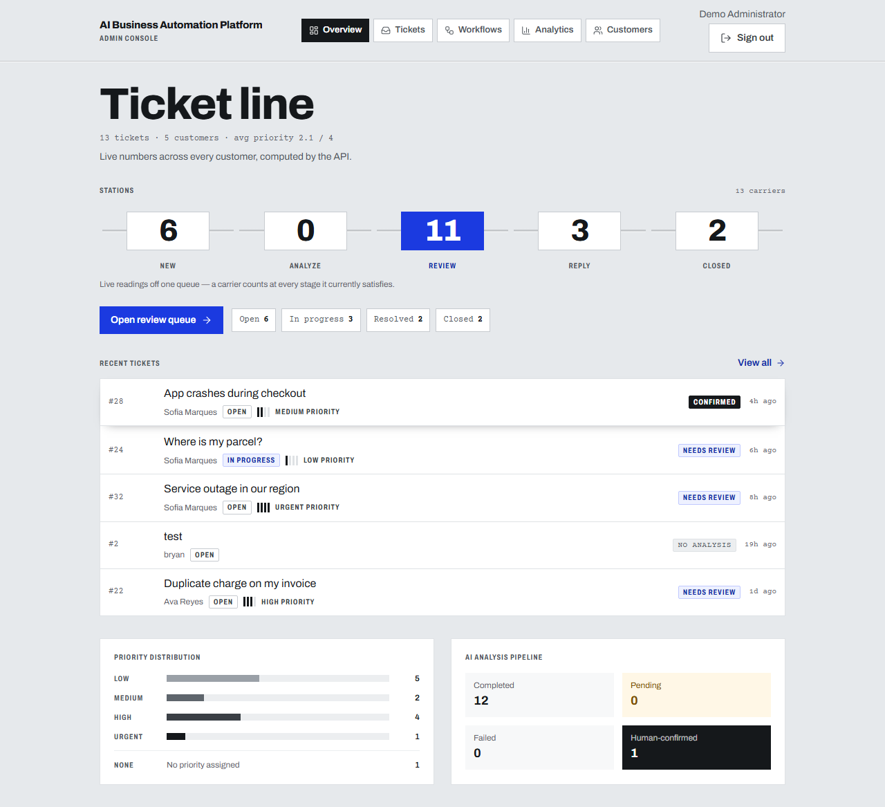
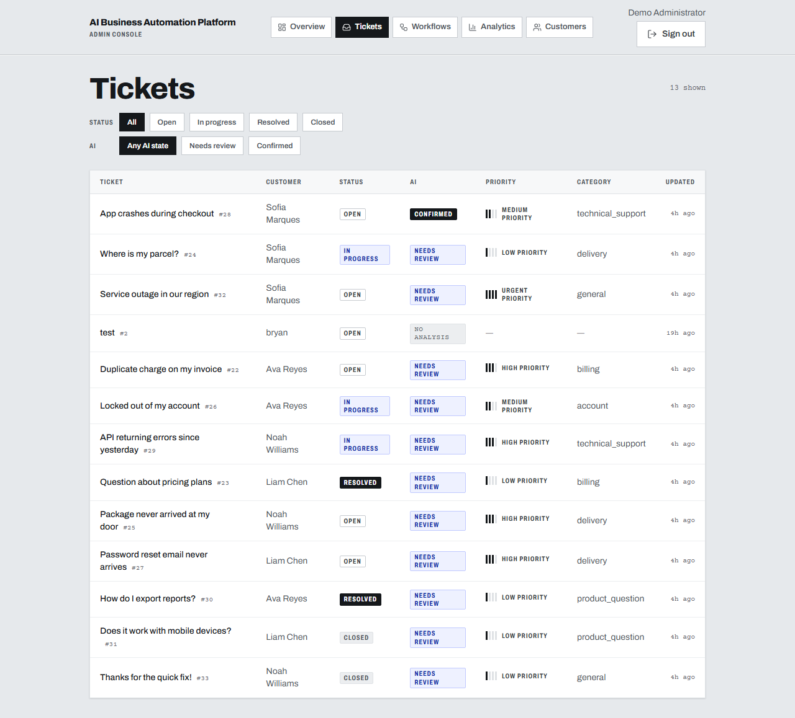
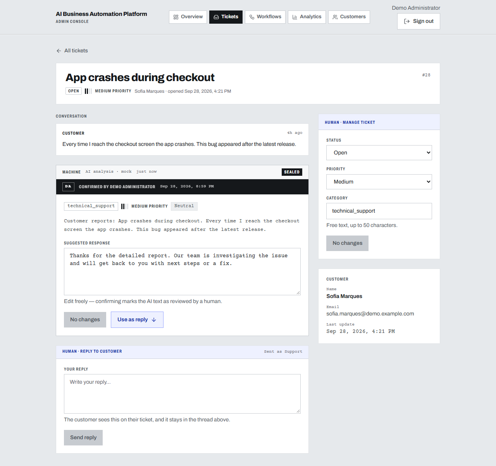
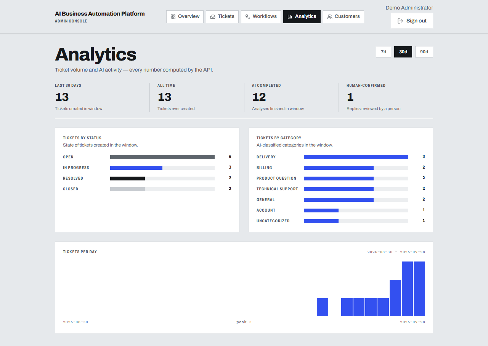
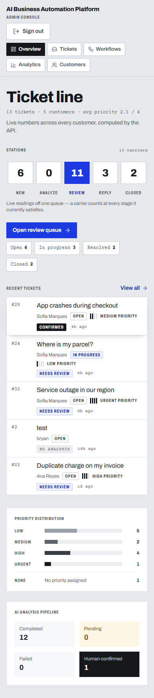
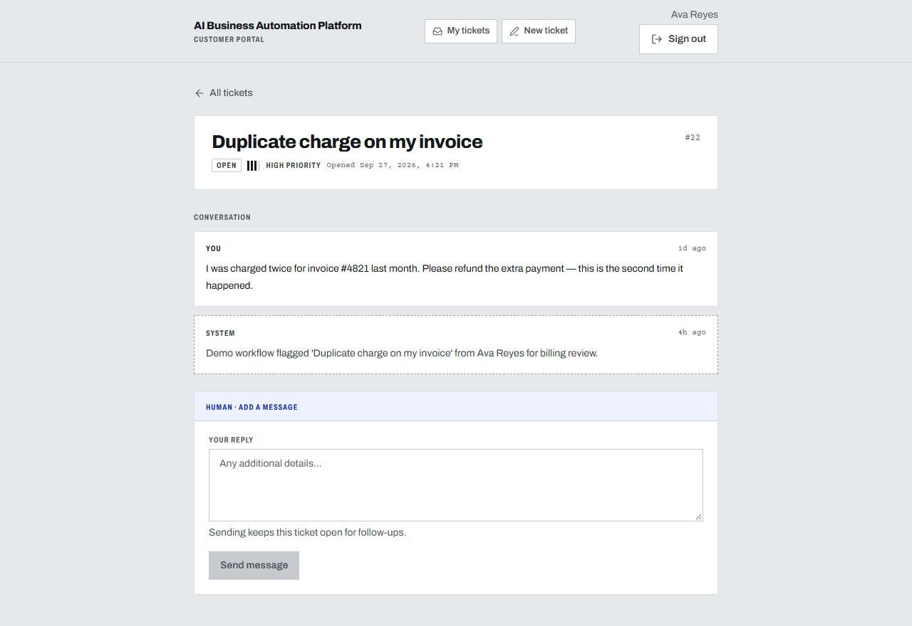
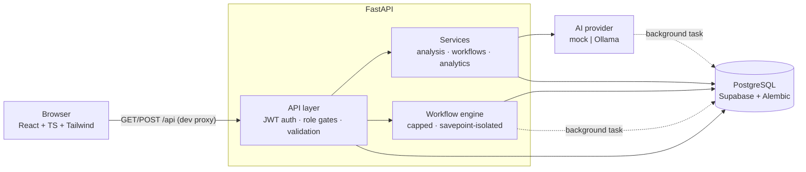

# AI Business Automation Platform

A full-stack support-desk automation platform: customers submit tickets, an AI
pipeline classifies and drafts a reply, and an administrator confirms it before
anything is sent. Built as a **pneumatic-tube dispatch desk** — an aluminium
panel where every colour means exactly one thing and every stamp records who
acted.

**Stack:** React + TypeScript + Tailwind (Vite) · Python + FastAPI ·
PostgreSQL (Supabase) · AI provider behind a backend-only abstraction
(deterministic `mock` by default, **Ollama** optional).

---

## Quick Start

### 1. Run the backend

```powershell
cd backend
python -m venv .venv
.venv\Scripts\python -m pip install -r requirements.txt
copy .env.example .env        # fill in DATABASE_URL + JWT_SECRET_KEY
.venv\Scripts\python -m alembic upgrade head
.venv\Scripts\uvicorn app.main:app --reload
```

Interactive API docs: <http://localhost:8000/docs>

> **Supabase note:** use the **direct** or **session** connection (port 5432).
> The transaction pooler (6543) rejects DDL and breaks Alembic migrations.
> Prefix the string with `postgresql+psycopg://`.

### 2. Run the frontend

```powershell
cd frontend
npm install
npm run dev
```

App: <http://localhost:5173> — the dev server proxies `/api` to port 8000.

### 3. Seed demo data and sign in

```powershell
cd backend
.venv\Scripts\python -m app.cli.seed_demo
```

| Account | Email | Password |
| --- | --- | --- |
| Administrator | `admin@demo.example.com` | `Demo!Pass123` |
| Customer | `ava.reyes@demo.example.com` | `Demo!Pass123` |

Everything the seeder creates is tagged `is_demo`; remove it with
`python -m app.cli.seed_demo --remove` — real data is never touched.

Public registration never grants admin. Create your own admin from `backend/`:

```powershell
.venv\Scripts\python -m app.cli.create_admin --email you@example.com --password <strong-password>
```

### 4. (Optional) Real AI analysis with Ollama

The default `mock` provider needs nothing — it is offline, deterministic, and
what all tests use. For model-backed analysis, pick one:

**Ollama cloud** (no install, free starter allowance):

```ini
# backend/.env
AI_PROVIDER=ollama
OLLAMA_BASE_URL=https://ollama.com
OLLAMA_MODEL=gpt-oss:20b
OLLAMA_API_KEY=your-key-here
```

**Local Ollama** (100% free/unlimited):

```ini
AI_PROVIDER=ollama
OLLAMA_BASE_URL=http://localhost:11434
OLLAMA_MODEL=llama3.2
OLLAMA_API_KEY=
```

Restart the backend after changing `.env`. Analysis runs in the background;
failures are persisted as `failed` analyses and never break ticket creation.

---

## Screenshots

<!-- Captured 2026-09-28 with headless Chrome at 1280×880 / 390×844.
     Regenerate with the capture script documented in .impeccable/. -->

| Admin overview | Tickets |
| --- | --- |
|  |  |

| Ticket detail + AI review | Analytics |
| --- | --- |
|  |  |

| Admin (mobile) | Customer portal |
| --- | --- |
|  |  |

---

## Features

**Customer portal** (`/portal`)
- Signup/login (JWT in `localStorage`, sent as `Authorization: Bearer`),
  role-aware redirects
- Submit tickets, track their own tickets, read status/priority and reply
- AI analysis runs automatically after submission — the customer sees a
  suggested reply drafted for a human to confirm

**AI analysis pipeline**
- One contract, swappable engines: `mock` (keyword rules, offline,
  deterministic) and `ollama` (cloud or local, JSON output)
- Classifies category, priority, sentiment; drafts summary + suggested
  response; writes category/priority back to the ticket
- Failures can never break ticket creation: any provider or validation error
  is persisted as a `failed` analysis with a sanitized message

**Admin console** (`/admin`, admin role required)
- **Ticket line**: a five-station rail (NEW → ANALYZE → REVIEW → REPLY →
  CLOSED), recent carriers, one primary action
- Cross-customer management: status/priority filters, triage queue
  (`?review=awaiting|confirmed`), status changes, tags
- AI reply review with human confirmation (`is_human_confirmed`), sealed with
  the reviewer's initials (`confirmed_by`)
- Customers list; workflows CRUD; analytics (7/30/90-day windows, UTC-day
  buckets, zero-filled)

**Workflow engine** (capped by design — `PLAN.md` §5)
- Single trigger `ticket.created` → AND-only conditions (≤ 5) → up to 5
  actions from 4 types: `set_priority`, `add_tag`,
  `generate_suggested_response`, `record_notification`
- Guarantee: exactly one `workflow_runs` row per evaluation (`success`,
  `skipped`, or `failed`); failing actions roll back via savepoint, so a
  half-applied automation leaves no trace beyond its failed run
- The engine never raises into a request

---

## Architecture



Ticket creation returns immediately; AI analysis and workflow evaluation run
as background steps, each opening its own database session.

---

## Design system

The visual language is documented in [`DESIGN.md`](DESIGN.md) — token
frontmatter plus eight canonical sections. The short version:

- **Six hues, one meaning each.** `route` = needs a human · `ink` = a human
  marked it · `signal` = a machine has it · `fault` = failed · `hazard` =
  blocked/irreversible · `panel` = idle. There is **no green**.
- **Priority is a count**, never a colour: four signal bands, unfilled slots
  drawn as ghosts.
- **Type carries authorship.** Archivo = something a person wrote;
  Courier Prime = something the machine printed.
- **Provenance is triple-encoded:** dashed edge + grey `Machine` head =
  unsealed; solid edge + blue `Human · …` strip = confirmed; the ink band
  striking across the record is the only motion in the system.

Design tokens and component snippets also live in
[`.impeccable/design.json`](.impeccable/design.json).

---

## Tech stack

| Layer | Choice |
| --- | --- |
| Frontend | Vite + React 19 + TypeScript + Tailwind CSS 4 + React Router 7 |
| Icons / type | lucide-react (1.75 stroke) · Archivo Variable · Courier Prime |
| Backend | FastAPI + Pydantic settings + SQLAlchemy 2 + Alembic |
| Database | PostgreSQL (Supabase), session pooler on port 5432 |
| Auth | JWT (Bearer), bcrypt via passlib, admin role gated server-side |
| AI | Provider interface: `mock` (default) · `ollama` (cloud or local) |
| Tests | pytest (78 passed + 1 skipped) · ESLint + `tsc` build gate |

## Prerequisites

- Python 3.12+
- Node 20+ (tested on 24)
- A Supabase project (any PostgreSQL connection works)
- Optional for real AI analysis: an [Ollama](https://ollama.com) API key or a
  local install with a pulled model

---

## Verification

```powershell
# Backend — 78 passed, 1 skipped (the Ollama live test skips when unconfigured)
cd backend
.venv\Scripts\python -m pytest -q

# Frontend
cd frontend
npx tsc --noEmit
npm run lint
npm run build

# Generated API docs
cd backend
.venv\Scripts\uvicorn app.main:app   # then open http://localhost:8000/docs
```

---

## Project structure

```text
backend/
  app/
    api/          # routers: auth, tickets, admin, workflows
    ai/           # provider abstraction: mock.py, ollama.py, schemas.py
    workflows/    # capped automation engine
    services/     # analysis, analytics, workflow services
    schemas/      # Pydantic request/response contracts
    models/       # SQLAlchemy models + enums
    cli/          # create_admin, seed_demo
    core/         # config, security
  alembic/        # migrations
  tests/          # 78 tests (auth, tickets, admin, analysis, workflows, seed, ollama)
frontend/
  src/
    pages/        # home, auth, portal/, admin/
    features/     # auth context + route guards
    services/     # typed API client
    components/   # shared UI primitives
    index.css     # @theme tokens + component layer
```

## Documentation

| File | Purpose |
|------|---------|
| `DESIGN.md` | Design system: tokens, palette law, typography, components |
| `PRODUCT.md` | Product brief and direction contract |
| `PLAN.md` | Implementation roadmap (milestones M0–M6) |
| `AGENTS.md` | AI agent entry point |
| `.ai/` | Architecture, rules, workflow, context, task specs |
| `.impeccable/` | Design direction, critique, finish-review captures |
| `progress.md` / `decisions.md` / `results.md` | Persistent project state |

## License

Not specified — add one before publishing publicly.
